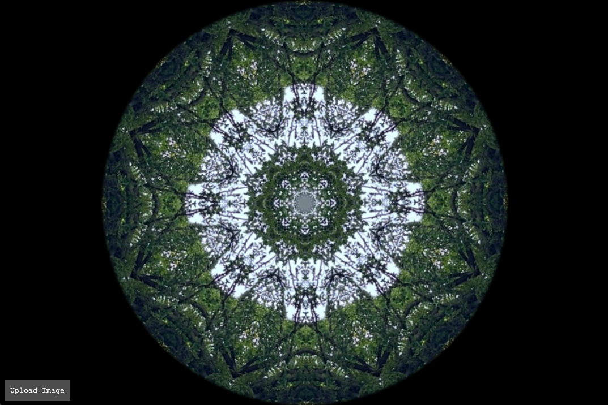

kaleidoscope
============

Kaleidoscopic image transformations for your webbrowser.



Checkout a hosted version on my [github pages](https://nstahl.github.io/kaleidoscope/kaleidoscope.html).

> Swipe right or left for the next image, up or down to toggle between colors and grayscale.

## Background

This is a HTML canvas version of the original version that I built with my sister pre-2014. LLM assistants helped me plan and write the code.

## Running the Dev Server

To run a local development server and view the kaleidoscope experience, follow these steps:

1. Open a terminal and navigate to the project directory.

2. Run the following command to start a Python HTTP server:

   ```
   python3 -m http.server 8000
   ```

3. Open your web browser and go to:

   ```
   http://localhost:8000/kaleidoscope.html
   ```

This will launch the kaleidoscope experience in your default web browser.
